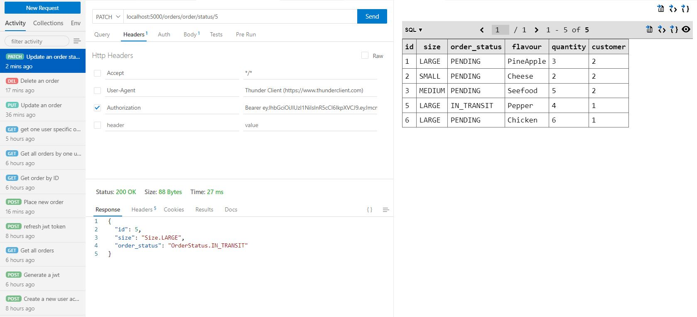
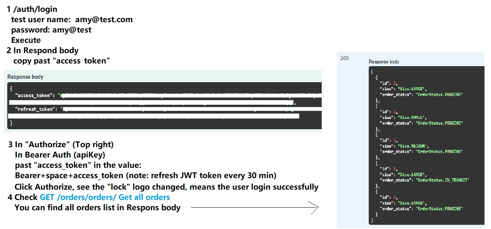
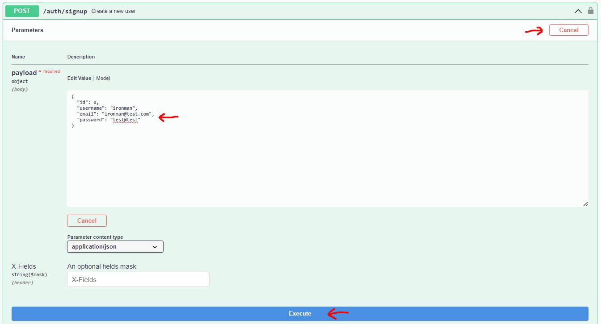
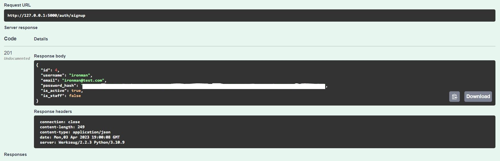
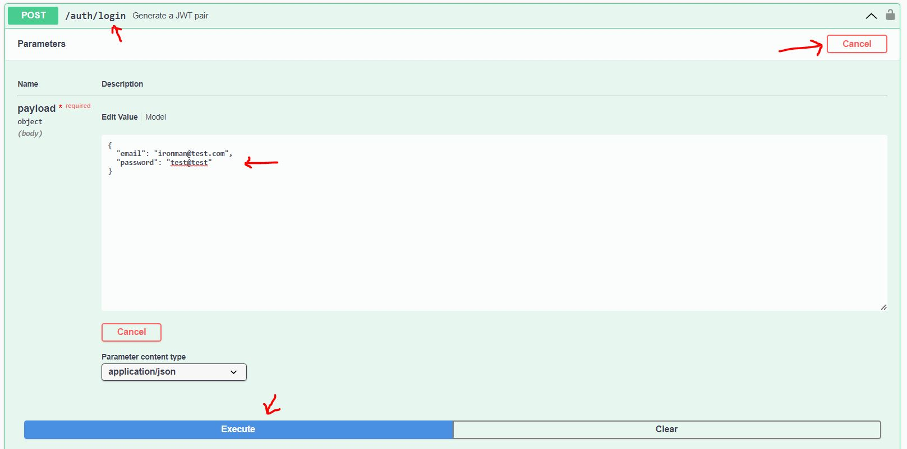
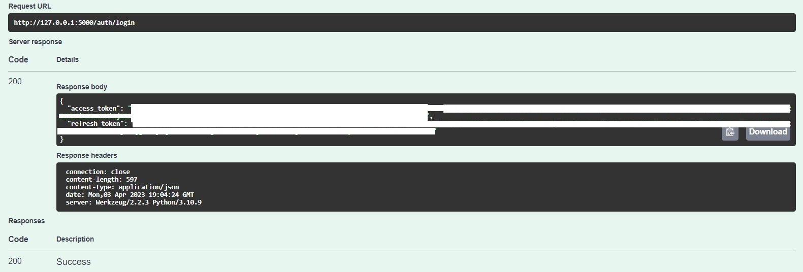
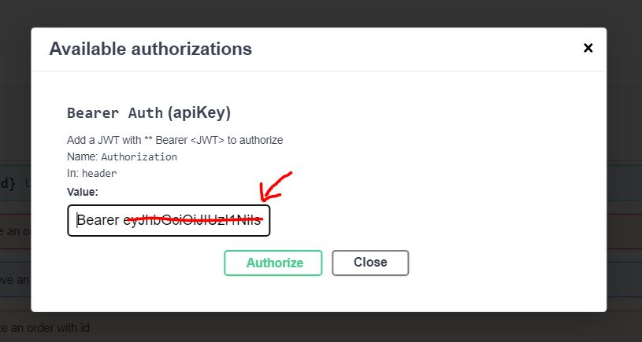
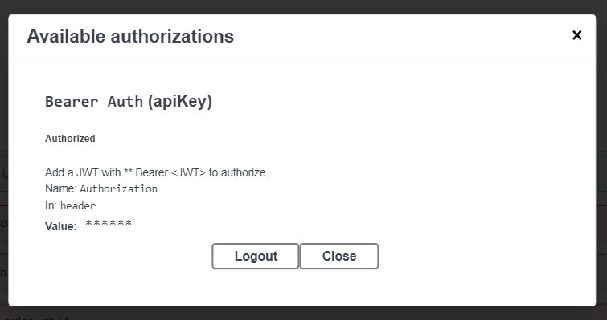

# FLASK REST API PROJECT, deployed on Render.com

Deployed in Rend, check it out 👉 https://flask-rest-api-project-rmrw.onrender.com/
<br>Database transformation: SQLite -> PostgreSQL

## Tools and Technologies 🛠️:

Flask, Flask-SQLAlchemy, Flask-JWT-Extended, Flask-RESTX, Python-Decouple, PyTest, SwaggerUI, Werkzeug, Unittest, Render.com, PostgreSQL, DB browser, SQLite

## Practicing Include 📚:

- Flask REST API with Python
- Environment variables with Python-Decouple
- JWT Authentication with Flask-JWT-Extended
- Databases with Flask-SQLAlchemy
- How to write Unit Tests with Unittest and PyTest
- Documenting REST APIs with SwaggerUI and Flask-RESTX
- Error Handling with Werkzeug

## Basic Setup 🚀

Enter the project folder and create a virtual environment

```bash
$ python -m venv env
$ source env/bin/actvate #On linux Or Unix
$ source env/Scripts/activate #On Windows
$ pip install -r requirements.txt #Install all requirements
python runserver.py #Run the server
```

## DEMO Time 🛒

## Run the project in development environment

Database: SQLite || Backend test tool: Thunder Client<br>
localhost http://127.0.0.1:5000/


## Run the project in production environment



## 1. Signup a new user




## 2. Login with the user




## 3. Authorization with JWT successfully





## Reference:

👍 **Very good Flask learning resource from Youtuber [Ssali Jonathan](https://www.youtube.com/watch?v=OEZxEY_wdN4&list=PLEt8Tae2spYnFMndU9EM082imnnzke07J)**
